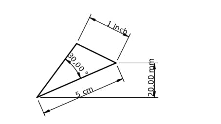
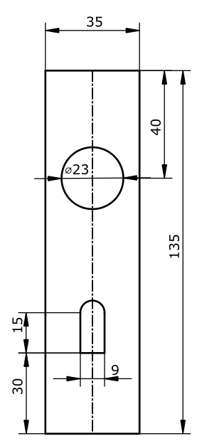

# CAD Script examples

## Triangle with given sides



```mathematica
Sketch Triangle {
 
 Point A at:{0,0}
 Point B at:[10,10]
 Point C at: [0,10]

 Line AB from: A to: B length: 5cm
 Line BC from: B to: C length: 1in
 Line CA from: A to: C

 Constrain angle AB CA angle: 30 deg

 @helper
 Point H1
 
 @helper
 Line from: A to: H1 direction: horizontal

 @helper
 Line from: H1 to: B length: 20 mm direction: vertical 
}
```

## Door handle cover plate


```mathematica
Sketch Main {
	import Rectangle R with Width = 35 Height= 135

	// create a helper center line
	@helper
	Point hTop

	@helper
	Point hBot

	@helper
	Line centerLine from: hBot to: hTop
	// constrain helper points to bisect rectangle in the middle
	Constrain point on line point: hTop line: R->Top [bisector]
	Constrain point on line point: hBot line: R->Bottom [bisector]

	// Add Circle and constrain to helper
	import CCircle c with diameter = 23
	Constrain point on line point: c->CircleCenter line: centerLine
	Constrain point2line point: c->CircleCenter line: R->Top distance: 4cm

	// Add keyhole from partial sketch
	import KeyHole keyHole with Height = 15 Width = 9
	Constrain point on line point: keyHole->ArcCenter line: centerLine
	Constrain point2line point: keyHole->BaseRight line: R->Bottom
	distance: 3 cm
}

partial Sketch CCircle {
	parameter diameter default: 0
	@helper Point CircleCenter
	Circle center: CircleCenter diameter: diameter
}

partial Sketch Rectangle {
	parameter X0 default: 0
	parameter Y0 default: 0
	parameter Width default: 10
	parameter Height default: 10
 
	Point PLeftDown at: {X0,Y0}
	Point PRightDown at: {Width, Y0}
	Point PRighttUp at: {Width, Height}
	Point PLeftUp at: {X0, Height}
 
	// All points are fixed, so no need for length or direction constraints
	Line Bottom from: PLeftDown to: PRightDown
	Line Top from: PLeftUp to: PRighttUp
	Line from: PLeftUp to: PLeftDown
	Line from: PRighttUp to: PRightDown
}

partial Sketch KeyHole {
	parameter Width default: 10
	parameter Height default: 10
 
	@helper Point BaseLeft at:[0,0]
	@helper Point BaseRight at: [Width,0]
	@helper Point TopRight at: [Width, Height]
	@helper Point TopLeft at: [0, Height]
	@helper Point ArcCenter at: [Width / 2, Height]
 
	Line Base from: BaseLeft to: BaseRight length: Width direction: horizontal
 
	Line Left from: BaseLeft to: TopLeft length: Height direction: vertical
 
	Line Right from: BaseRight to: TopRight length: Height direction: vertical
 
	Arc A start: TopLeft end: TopRight center: ArcCenter
 
	Constrain tangent line: Left arc: A
}
```
