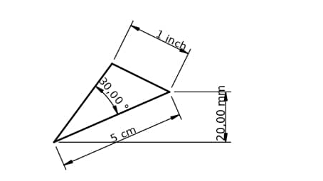

# Triangle example

Our task is given in the drawing below. We have to calculate the positions of each point in a millimetre based grid system, given that the left point is  at (0,0)



## Solving using SolveSpace API

While its not commonly used as a Programming interface it can be built as a library. The folowing function calculates the 3 points. 

```C
    Slvs_hGroup g;
    double qw, qx, qy, qz;

    g = 1;
    /* First, we create our workplane. Its origin corresponds to the origin
     * of our base frame (x y z) = (0 0 0) */
    sys.param[sys.params++] = Slvs_MakeParam(1, g, 0.0);
    sys.param[sys.params++] = Slvs_MakeParam(2, g, 0.0);
    sys.param[sys.params++] = Slvs_MakeParam(3, g, 0.0);
    sys.entity[sys.entities++] = Slvs_MakePoint3d(101, g, 1, 2, 3);
    /* and it is parallel to the xy plane, so it has basis vectors (1 0 0)
     * and (0 1 0). */
    Slvs_MakeQuaternion(1, 0, 0,
                        0, 1, 0, &qw, &qx, &qy, &qz);
    sys.param[sys.params++] = Slvs_MakeParam(4, g, qw);
    sys.param[sys.params++] = Slvs_MakeParam(5, g, qx);
    sys.param[sys.params++] = Slvs_MakeParam(6, g, qy);
    sys.param[sys.params++] = Slvs_MakeParam(7, g, qz);
    sys.entity[sys.entities++] = Slvs_MakeNormal3d(102, g, 4, 5, 6, 7);

    sys.entity[sys.entities++] = Slvs_MakeWorkplane(200, g, 101, 102);

    /* Now create a second group. We'll solve group 2, while leaving group 1
     * constant; so the workplane that we've created will be locked down,
     * and the solver can't move it. */
    g = 2;
    /* These points are represented by their coordinates (u v) within the
     * workplane, so they need only two parameters each. */
    sys.param[sys.params++] = Slvs_MakeParam(11, g, 0.0);
    sys.param[sys.params++] = Slvs_MakeParam(12, g, 0.0);
    sys.entity[sys.entities++] = Slvs_MakePoint2d(301, g, 200, 11, 12);

    sys.param[sys.params++] = Slvs_MakeParam(13, g, 15.0);
    sys.param[sys.params++] = Slvs_MakeParam(14, g, 10.0);
    sys.entity[sys.entities++] = Slvs_MakePoint2d(302, g, 200, 13, 14);

    sys.param[sys.params++] = Slvs_MakeParam(15, g, 30.0);
    sys.param[sys.params++] = Slvs_MakeParam(16, g, 30.0);
    sys.entity[sys.entities++] = Slvs_MakePoint2d(303, g, 200, 15, 16);

    // create helper point
    sys.param[sys.params++] = Slvs_MakeParam(17, g, 0.0);
    sys.param[sys.params++] = Slvs_MakeParam(18, g, 30.0);
    sys.entity[sys.entities++] = Slvs_MakePoint2d(304, g, 200, 17, 18);

    /* And we create line segments with those endpoints. */
    sys.entity[sys.entities++] = Slvs_MakeLineSegment(400, g, 200, 301, 302);
    sys.entity[sys.entities++] = Slvs_MakeLineSegment(401, g, 200, 303, 302);
    sys.entity[sys.entities++] = Slvs_MakeLineSegment(402, g, 200, 301, 303);


    /* The length of our first line segment is 5 cm. */
    sys.constraint[sys.constraints++] = Slvs_MakeConstraint(
                                            1, g,
                                            SLVS_C_PT_PT_DISTANCE,
                                            200,
                                            5 * 10.0,
                                            301, 302, 0, 0);
     
      /* The length of our second line segment is 1 inch. */
    sys.constraint[sys.constraints++] = Slvs_MakeConstraint(
                                            2, g,
                                            SLVS_C_PT_PT_DISTANCE,
                                            200,
                                            1 * 25.4,
                                            302, 303, 0, 0);


    // first and third line have 30 degrees 
   sys.constraint[sys.constraints++] = Slvs_MakeConstraint(
                                            3, g,
                                            SLVS_C_ANGLE,
                                            200,
                                            30.0,
                                            0,0,400,402);

    // Position helper so its line with origin is horizontal
    sys.constraint[sys.constraints++] = Slvs_MakeConstraint(
                                            4, g,
                                            SLVS_C_HORIZONTAL,
                                            200,
                                            0,
                                            304,302,0,0);


    // position helper so its line with Second point is vertical
    sys.constraint[sys.constraints++] = Slvs_MakeConstraint(
                                            5, g,
                                            SLVS_C_VERTICAL,
                                            200,
                                            0,
                                            301,304,0,0);

    // Position second points vertical distance from helper to 20 unit
    sys.constraint[sys.constraints++] = Slvs_MakeConstraint(
                                            6, g,
                                            SLVS_C_PT_PT_DISTANCE,
                                            200,
                                            20.0,
                                            302, 304, 0, 0);

    // Constrain First point to origin so its fully constrained
    sys.constraint[sys.constraints++] = Slvs_MakeConstraint(
                                            7, g,
                                            SLVS_C_POINTS_COINCIDENT,
                                            200,
                                            0,
                                            301, 101, 0, 0);


    /* If the solver fails, then ask it to report which constraints caused
     * the problem. */
    sys.calculateFaileds = 1;

    /* And solve. */
    Slvs_Solve(&sys, g);

    if(sys.result == SLVS_RESULT_OKAY) {
        printf("solved okay\n");
        printf("line A (%.3f %.3f) to (%.3f %.3f)\n",
                sys.param[8].val, sys.param[7].val,
                sys.param[10].val, sys.param[9].val);

        printf("line B (%.3f %.3f) to (%.3f %.3f)\n",
                sys.param[10].val, sys.param[9].val,
                sys.param[12].val, sys.param[11].val);
    
         printf("line C (%.3f %.3f) to (%.3f %.3f)\n",
                sys.param[12].val, sys.param[11].val,
                sys.param[8].val, sys.param[7].val);

        printf("%d DOF\n", sys.dof);
    } else {
        int i;
        printf("solve failed: problematic constraints are:");
        for(i = 0; i < sys.faileds; i++) {
            printf(" %d", sys.failed[i]);
        }
        printf("\n");
        if(sys.result == SLVS_RESULT_INCONSISTENT) {
            printf("system inconsistent\n");
        } else {
            printf("system nonconvergent\n");
        }
    }

```

The output of the program is 
```
line A (0.000 0.000) to (45.826 20.000)
line B (45.826 20.000) to (28.375 38.456)
line C (28.375 38.456) to (0.000 0.000)
```

## CAD language
The plan is to create a language to describe these points lines and constraints in a human readable way

### First idea
Something similar to HTMl or XML

```
<Sketch

    // define point and constrain to origin
    <Point ref=A X=0 Y=0>

    // define point inside a line if needed
    // Constrain only Y parameter of second point    
    <Line 
        p1=A 
        p2=<Point ref=B Y=20 mm> 
        Length=5 cm
        ref=l_A
        >

    // reference is optional. No need to add if entity is not referenced in constraint
    <Line 
        p1=B
        p2=<Point ref=C>
        Length=1 inch
        >
    
    <Line p1=A p2=C ref=l_B>

    // put additional constraints to sketch
    <Constrain e1= l_A e2=l_B angle=30° >
    <Constrain p1= A p2= B vertical_distance= 20mm>
>
```

### Second idea
A language thats more "natural"

```
define Sketch(

    // define point and constrain to origin
    add Point as A at X=0, Y=0

    // constrain only Y parameter
    add Point as B at Y=20


    add 5 cm Line from A to B as l_A

    // define point inside line if needed 
    add 1 inch Line from B to (add Point as C)

    // name/reference is optional
    add Line from C to A as l_B

    constrain 30° angle to l_A and l_B 
    constrain 20mm vertical distance to A and B
)
 ```
