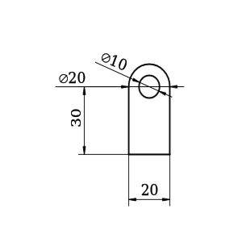

# Triangle example

Our task is given in the drawing below. We need calculate the positions of each point in a millimetre based grid system, given that the left bottom point is  at (0,0)




## CAD language
### Using the first language syntax

```diameterradius
<Sketch

    <Point ref=A X=0 Y=0>
    <Point ref=B>
    <Point ref=C>
    <Point ref=D>


    <Line horizontal p1=A p2=B Length= 2cm ref=Base >
    <Line vertical p1=B p2=C Length= 30 mm ref=RightSide>
    <Line p1=D p2=A ref=LeftSide>

    <Arc 
         start= C
         end= D 
         center = <Point ref=ArCenter>
         radius = 10mm
         >

    <Circle origin= ArCenter radius= 5 mm >

    <Constrain LeftSide Base  perpendicular>
    <Constrain LeftSide RightSide samelength>
>
```

### Using the second language syntax

```
define Sketch(

    add Point as A at (0,0)
    add Point as B
    add Point as C
    add Point as D


    add 2cm horizontal Line from A to B as Base
    add 3cm vertical Line from B to C as RightSide
    add Line from A to D as LeftSide

    add 10mm Arc D (add Point as ArCenter) C  
    add 5mm Circle at ArCenter

    constrain perpendicular at Base and LeftSide
    constrain samelength at RightSide and LeftSide

)
 ```

## Solving using SolveSpace API
As the library is not designed for using it "by hand"
anything more complex than a triangle hard to code in C.
For this reason I only write down the parameters, entities and constrains that the above codes would translate

```
    parameters:
        [Workplane params]
        Ax
        Ay
        Bx
        By
        Cx
        Cy
        Dx
        Dy
        ArCenterx
        ArCentery

    entities:
        points:
            A,B,C,D
        lines:
            Base,Left,Right
        other:
            arc
            circle

    constraints
        SLVS_C_POINTS_COINCIDENT -> A Origin(0,0)
        SLVS_C_HORIZONTAL-> Base
        SLVS_C_VERTICAL-> Right
        SLVS_C_PT_PT_DISTANCE-> A B 20mm
        SLVS_C_PT_PT_DISTANCE-> B C 30mm
        SLVS_C_DIAMETER -> circle 10mm
        SLVS_C_DIAMETER -> arc 20mm
        SLVS_C_PERPENDICULAR -> Base Left
        SLVS_C_EQUAL_LENGTH_LINES -> Right Left
```