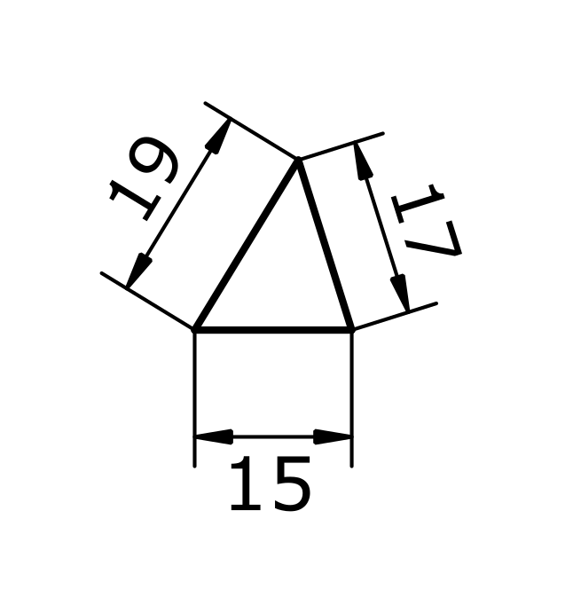

# Looping example

Our task is given in the drawing below. We need calculate the positions of each point in a millimetre based grid system.



I want to add a functionalit to the language to simplify repeating statements

# Looping with expression evaluation and string interpolation

```
define Sketch(

3 times do (i)
    add Point as "P_#(i)"
    add (15 + i * 2) mm Line from "P_$(i)" to "P_$((i+1) mod 3)" as "E_$(i)"
end

constrain horizontal E_0 

)
```

This would be the equivalent to

```
add Point as P_0
add 15 mm Line from P_0 to P_1 as E_0

add Point as P_1
add 17 mm Line from P_1 to P_2 as E_1

add Point as P_2
add 19 mm Line from P_2 to P_0 as E_2

constrain horizontal E_0

```

From this we can see that
* In a sketch the order of statements does not matter. We can refer to an item before adding it to the sketch
* Loop iterators start at zero
* References inside a loop can be added with string interpolation. This works by enclosing the name in "", and evaluating the expression inside the #(*exp*) block