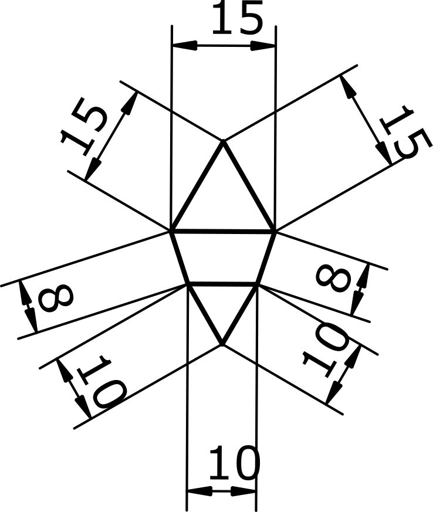

# Nested sketches example

Our task is given in the drawing below. We need calculate the positions of each point in a millimetre based grid system.



I want to add a functionalty to create reusable parts, with parameters

# Partial sketches with parameter

```
// equilateral traingle

define Partial Triangle(

    parameter len, defaults to 1 cm

    add Point as A
    add Point as B
    add Point as C

    add len Line from A to B as Base
    add len Line from B to C
    add len Line fomr C to A
)

define Sketch (

    add Triangle(len = 15 mm) as T1
    add Triangle(len = 10 mm) as T2

    add 8mm Line from T1->A to T2->B
    add 8mm Line from T1->B to T2->A

    constrain parallel to T1->Base and T2->Base
)


```

This would be the equivalent to

```
define Sketch (

    // first triangle
    add Point as A1
    add Point as B1
    add Point as C1

    add 15mm Line from A1 to B1 as Base1
    add 15mm Line from B1 to C1
    add 15mm Line fomr C1 to A1

    // second traingle

    add Point as A2
    add Point as B2
    add Point as C12

    add 10mm Line from A2 to B2 as Base2
    add 10mm Line from B2 to C2
    add 10mm Line fomr C2 to A2

    add 8mm Line from A1 to B2
    add 8mm Line from B1 to A2

    constrain parallel to Base1 and Base2
)


```